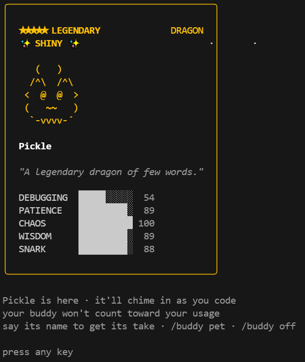

# 🐥 Buddy Reroller

基于 Bun 的 Web 应用，用于定制你的 Claude Code `/buddy` 伴侣宠物。通过条件搜索找到理想的伙伴，预览后一键应用，收藏你最喜欢的那只。

[English](./README_EN.md) | 中文

<p align="center">
  
  <br>
  <em>Pickle — 传奇 ✦ 闪光龙 · CHAOS 100</em>
</p>

## 功能特性

- **🔍 条件搜索** — 按物种、稀有度、眼睛、帽子、闪光状态筛选，WebSocket 实时显示搜索进度
- **📦 收藏集** — 本地加密存储，无限收藏
- **📖 图鉴** — 浏览全部 18 种物种、5 个稀有度、属性、帽子和眼睛
- **🎨 暗色游戏主题** — ASCII 艺术精灵图 + 动画展示
- **🔒 Pro 模块** — 满属性传奇搜索（独立模块，不包含在本仓库）

## 快速开始

```bash
# 安装依赖
bun install

# 启动开发服务器 (http://localhost:17840)
bun run dev

# 编译单文件可执行程序
bun run build

# 运行测试
bun test
```

## 工作原理

每个 `userID` 对应的伴侣是通过 **确定性生成** 的：使用 mulberry32 PRNG，以 `Bun.hash(userID + salt)` 为种子。这意味着：

- 相同的 userID 始终生成相同的伴侣
- 更改 userID 即可更换伴侣
- 搜索原理：不断生成随机 userID，直到找到匹配条件的伴侣

找到后，新的 `userID` 会写入 `~/.claude.json`。重启 Claude Code 并运行 `/buddy` 即可看到新伴侣。

## 伴侣系统

| 稀有度 | 概率 | 属性下限 |
|--------|------|----------|
| 普通 (Common) | 60% | 5 |
| 优秀 (Uncommon) | 25% | 15 |
| 稀有 (Rare) | 10% | 25 |
| 史诗 (Epic) | 4% | 35 |
| 传奇 (Legendary) | 1% | 50 |

- **18 种物种**：duck、goose、blob、cat、dragon、octopus、owl、penguin、turtle、snail、ghost、axolotl、capybara、cactus、robot、rabbit、mushroom、chonk
- **6 种眼睛**：· ✦ × ◉ @ °
- **8 种帽子**：none、crown、tophat、propeller、halo、wizard、beanie、tinyduck
- **5 项属性**：DEBUGGING（调试）、PATIENCE（耐心）、CHAOS（混乱）、WISDOM（智慧）、SNARK（吐槽）— 每只伴侣有一个巅峰属性和一个短板属性

## 技术栈

- **运行时**：[Bun](https://bun.sh)（HTTP 服务器、WebSocket、`bun build --compile`）
- **前端**：React 19 + 暗色游戏主题 CSS
- **存储**：本地加密收藏集存储
- **构建**：`bun build --compile` 单文件可执行程序

## 项目结构

```
src/
├── core/           # PRNG、伴侣生成、精灵图、配置读写、存储
├── pro/            # Pro 模块（接口 + 空实现 fallback + 加载器）
├── api/            # HTTP 处理器 + WebSocket 搜索引擎
└── server.ts       # Bun HTTP 服务器入口
frontend/
├── components/     # React 组件（搜索、收藏集、图鉴）
├── App.tsx         # 主应用（标签页切换）
└── styles.css      # 暗色游戏主题
tests/              # 34 个测试（核心算法、精灵图、配置、存储）
scripts/
└── build.ts        # 单文件 exe 构建脚本
```

## 下载

预编译的可执行文件可在 [Releases](https://github.com/yourusername/buddy-reroller/releases) 页面下载：
- **Windows**: `buddy-reroller.exe`
- **macOS**: `buddy-reroller`
- **Linux**: `buddy-reroller`

**注意**：Pro 功能（满属性传奇搜索）已包含在所有版本中，但需要购买激活码解锁。详见下方说明。

## Pro 功能

Pro 模块提供 **满属性传奇搜索** — 在传奇稀有度下找到属性总和最高的伴侣，并支持指定巅峰/短板属性筛选。该功能使用独立的 `pro-impl.ts` 模块，**不包含**在本仓库中。

**获取 Pro：** 在 [爱发电](https://ifdian.net/item/0cfbb586300c11f1aa1452540025c377) 购买永久激活码，在应用的设置页面输入 `BR-` 开头的密钥即可立即解锁。

开源版包含完整的以下功能：
- 常规搜索（支持物种、稀有度、眼睛、帽子、闪光等所有条件）
- 无限收藏集存储
- 伴侣预览与应用
- 物种图鉴

## 许可证

MIT
